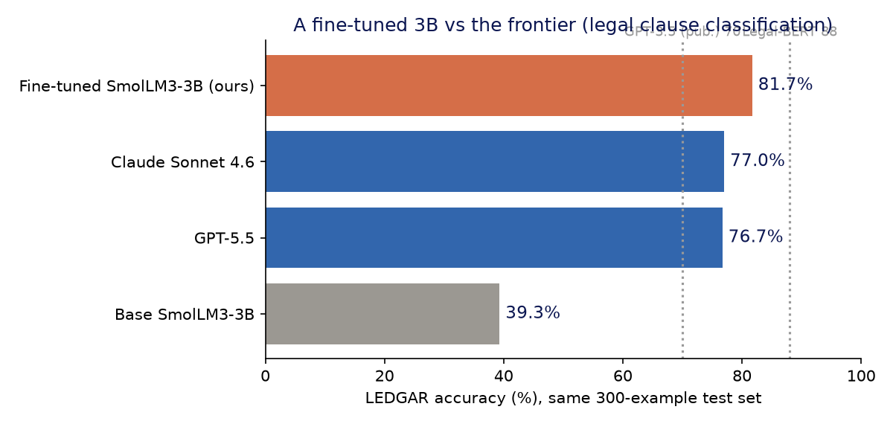

# Vertical Small LLM

Fine-tune a 3B model for one narrow classification job, then compare it with frontier models on the same held-out examples.



## Recorded experiment

The original LEDGAR smoke run used 4,000 training clauses and a fixed 300-example test sample:

| Model | Accuracy |
|---|---:|
| Fine-tuned SmolLM3-3B | 81.7% |
| Claude Sonnet 4.6 | 77.0% |
| GPT-5.5 | 76.7% |
| Base SmolLM3-3B | 39.3% |

This is a specialist versus zero-shot generalists, not a universal model-quality benchmark. The 3B model learned LEDGAR's label conventions from 4,000 examples. The frontier models received the full label list once in the prompt. The sample is small enough that the honest reading is "matches the frontier and noses ahead," not "a 3B model is smarter."

The public repo does not include the large adapter or original prediction files. A code audit also found that the original label matcher was too permissive with empty and unrelated output. The matcher now fails closed, but the original predictions are unavailable for rescoring. Treat the table and tracked chart as a historical smoke-run record. Reproduce the run with the current scorer before citing the numbers. The exact protocol and claim boundary are in [EXPERIMENT.md](EXPERIMENT.md).

## What you need

- Linux with an NVIDIA CUDA GPU
- Python 3.10 or 3.11
- About 50GB of free disk for model, dataset, adapter, and caches
- A 24GB or larger GPU for the default QLoRA path
- A DGX Spark or 80GB-class accelerator for the bf16 path
- Optional: an Anthropic or OpenAI API key, or authenticated `claude` / `codex` CLIs, for frontier comparisons

The local base and fine-tuned evaluations do not require an API key.

## Quickstart

```bash
git clone https://github.com/kukeshajanth/vertical-small-llm.git
cd vertical-small-llm
python3 -m venv .venv
source .venv/bin/activate

# 24GB+ CUDA GPU, default QLoRA path
pip install -r requirements-qlora.txt

# Fast checks before downloading models
python3 -m unittest discover -v

# Base eval -> 4,000-example fine-tune -> fine-tuned eval
bash run_hero.sh qlora
```

On a DGX Spark or another large-memory accelerator, install `requirements.txt` and run:

```bash
bash run_hero.sh bf16
```

`run_hero.sh` writes summaries and predictions to `runs/`, the adapter to `adapters/`, and the training log to `hero.log`.

## Add frontier baselines

Every evaluator uses the same deterministic test sample. Choose one transport.

### API path

```bash
cp .env.example .env
# Add ANTHROPIC_API_KEY and/or OPENAI_API_KEY.
set -a
source .env
set +a

python3 eval_frontier.py --dataset ledgar --provider anthropic \
  --model claude-sonnet-4-6 --limit 300 --name "Claude Sonnet 4.6"

python3 eval_frontier.py --dataset ledgar --provider openai \
  --model gpt-5.5 --limit 300 --name "GPT-5.5"
```

### Authenticated CLI path

```bash
python3 cli_frontier.py --dataset ledgar --engine sonnet-4.6 --limit 300 --workers 4
python3 cli_frontier.py --dataset ledgar --engine gpt-5.5 --limit 300 --workers 4
```

CLI runs use your existing Claude or Codex login. They are concurrent agent invocations, so their wall-clock throughput is recorded separately from serial API latency.

Generate the comparison table and one chart per dataset:

```bash
python3 report.py
```

## Run it with an agent

Paste this into a coding agent with terminal access to the target machine:

```text
Clone https://github.com/kukeshajanth/vertical-small-llm and follow AGENTS.md exactly.

First inspect the machine. Confirm Linux, Python 3.10 or 3.11, an NVIDIA CUDA GPU, available VRAM, and at least 50GB free disk. Do not install or run anything if those checks fail. Choose qlora for a 24GB to 79GB GPU. Choose bf16 only for a DGX Spark or an 80GB-class accelerator.

Create a virtual environment, install the correct requirements, run the unit tests, then run the LEDGAR base evaluation, fine-tune, and fine-tuned evaluation. Run frontier comparisons only if an API key is already available in the environment or the claude/codex CLI is already authenticated. Never print or store credentials.

Return the exact commands used, hardware detected, artifact paths, error count, sample count, and measured accuracy from the generated run JSON. Do not repeat the README's recorded 81.7% result unless this machine reproduces it. Stop and explain the blocker if CUDA, disk, dependencies, authentication, or a model ID fails.
```

The repository's [AGENTS.md](AGENTS.md) is the full machine-readable runbook.

## Experiment flow

```bash
# Base 3B, no training
python3 eval_local.py --dataset ledgar --limit 300 --name "base SmolLM3-3B"

# Fine-tune. Use --no-4bit only on a large-memory accelerator.
python3 train_lora.py --dataset ledgar --train-size 4000 --epochs 2 \
  --batch 4 --grad-accum 2 --max-length 1536 \
  --out adapters/ledgar-smollm3-3b

# Fine-tuned 3B, same held-out sample
python3 eval_local.py --dataset ledgar \
  --adapter adapters/ledgar-smollm3-3b --limit 300 \
  --name "fine-tuned SmolLM3-3B"
```

The fixed seed is `0`. Increase `--limit` for a tighter estimate. Do not compare runs with different datasets, sample sizes, seeds, prompts, or scoring logic as though they were the same experiment.

## Two verticals

- **LEDGAR** is the default: legal contract-clause classification with 100 labels.
- **Banking77** is a second path: banking-support intent classification with 77 labels.

Pass `--dataset banking77` to the training and evaluation commands to use the second vertical.

## Repository map

| File | Purpose |
|---|---|
| `data.py` | Loads each dataset and builds deterministic prompts and splits. |
| `train_lora.py` | Fine-tunes SmolLM3-3B with QLoRA or bf16 LoRA. |
| `eval_local.py` | Scores the base or fine-tuned local model and saves predictions. |
| `eval_frontier.py` | Scores Claude or GPT through provider APIs and saves predictions. |
| `cli_frontier.py` | Scores frontier models through authenticated local CLIs. |
| `match.py` | Normalizes model text to a valid label and fails closed on invalid output. |
| `report.py` | Builds dataset-specific tables and charts from run summaries. |
| `gen_charts.py` | Regenerates article assets from local artifacts when those artifacts exist. |
| `run_hero.sh` | Runs the base, training, and fine-tuned LEDGAR path. |
| `AGENTS.md` | Execution contract for coding agents. |
| `EXPERIMENT.md` | Protocol, artifact status, and interpretation boundary. |

## Scoring rules

- Every model is scored with top-1 accuracy on the same held-out sample.
- Exact labels, labels wrapped in a short sentence, and close spelling variations can match.
- Empty, failed, or unrelated output is invalid and counts as incorrect.
- API and CLI errors are counted and saved with the prediction artifacts.
- Frontier model IDs change. Verify availability in your account before the run.

## Add your own vertical

Add an entry to `REGISTRY` in `data.py` with the Hugging Face dataset ID, split names, text field, label field, and a short domain description. The dataset must expose a `ClassLabel` label feature. Keep a held-out split that training never sees.

## License

MIT. See [LICENSE](LICENSE).
